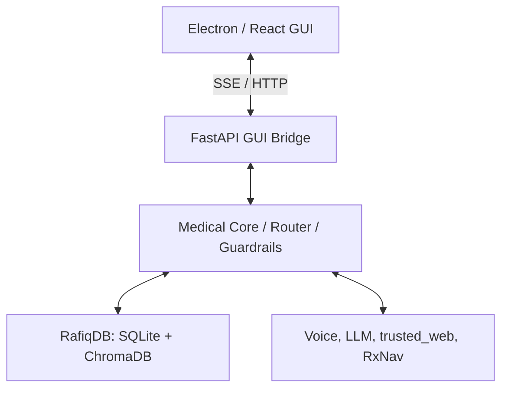

# 🏗️ Architecture Design: Rafiq System

Rafiq System uses a **Clean Architecture** model distributed as a local-first desktop application with cloud fallback APIs.

## Layer Descriptions
1. **Presentation Layer (React + Electron)**: Handles visual feedback, audio playback cues, and patient interface.
2. **Bridge Layer (FastAPI)**: Translates IPC/HTTP requests, handles server-sent events (SSE) for real-time speech and logs.
3. **Core Domain Layer**: Contains safety guardrails, privacy pseudonymizer, and medical query routing.
4. **Service Layer**: Third-party APIs (Groq, Gemini, Azure TTS, RxNav) and file system/web cache routines.
5. **Data Layer**: Relational tables (SQLite) and semantic vector index (ChromaDB).# 🛡️ Core Engine Components

* `medical_router.py`: Classifies queries.
* `medical_guardrails.py`: Blocks dosing and unsafe diagnostics.
* `privacy.py`: De-identifies text.
# 🗄️ Database Architecture

* **SQLite File**: `rafiq_v3.db` / `test_rafiq_v4_1.db`. Holds structural clinical metadata, history, schedules.
* **ChromaDB Folder**: `rafiq_chroma_v4`. Holds vector indexing chunks.
# 💻 GUI Component Map

* `src/main.tsx`: App entry.
* `components/`: contains layouts, pill schedule visualization.
* `electron/main.cjs`: Desktop window shell config.
# 🌐 AI Provider Configurations

* **Groq API**: whisper-large-v3, llama-3.3-70b-versatile.
* **Gemini API**: gemini-embedding-2.
* **Azure Edge**: edge-tts speech engine.
# 🛠️ Backend Services Description

* `conv_processor.py`: Orchestrates state, updates memory, and calls external services.
* `tts_service.py`: Generates voice.
* `stt_service.py`: Transcribes voice.
* `rxnav_interactions.py`: Validates drug safety.
