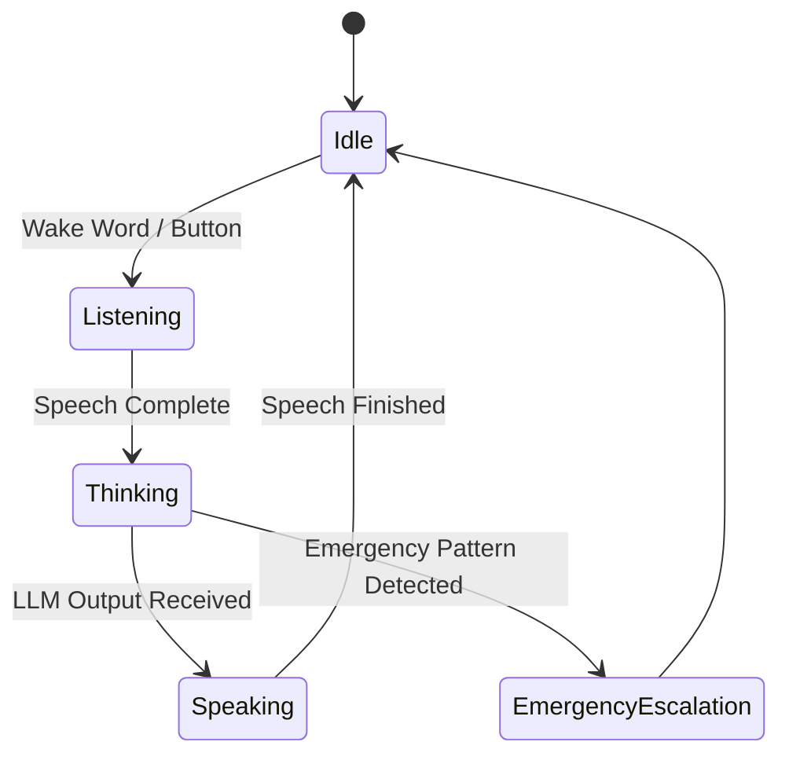

# 🔄 Conversational State Machine

```mermaid
stateDiagram-v2
    [*] --> Idle
    Idle --> Listening : Wake Word / Button
    Listening --> Thinking : Speech Complete
    Thinking --> Speaking : LLM Output Received
    Speaking --> Idle : Speech Finished
    Thinking --> EmergencyEscalation : Emergency Pattern Detected
    EmergencyEscalation --> Idle
```