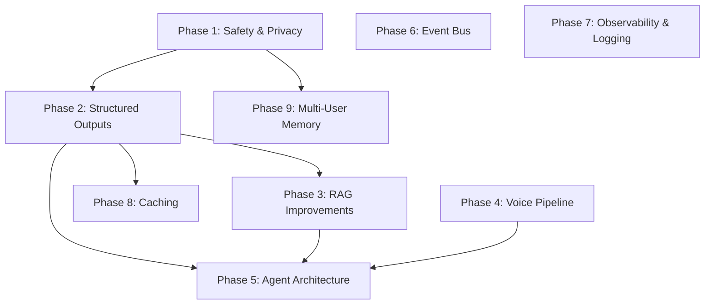

# 🕸️ Dependency Graph & Order of Execution

Below is the dependency graph showing the prerequisites and logical execution sequence for the 9 phased refactoring tasks.

## 📋 Recommended Execution Ordering
1. **Phase 1 (Safety & Privacy)** - Pre-requisite for de-identification and data handling.
2. **Phase 2 (Structured Outputs)** - Provides the data models for clinical extraction and query parsing.
3. **Phase 4 (Voice Pipeline)** - Independent local voice capture upgrade.
4. **Phase 7 (Observability & Logging)** - Independent setup for developer analytics.
5. **Phase 8 (Caching)** - Integrates with Phase 2 models for performance gains.
6. **Phase 3 (RAG Improvements)** - Enhances vector retrievals based on structured query models.
7. **Phase 5 (Agent Architecture)** - Ties together structured outputs, RAG, and voice streams.
8. **Phase 6 (Event Bus)** - Decoupled state transition bus.
9. **Phase 9 (Multi-User Memory)** - Completes the refactoring by partitioning database structures.